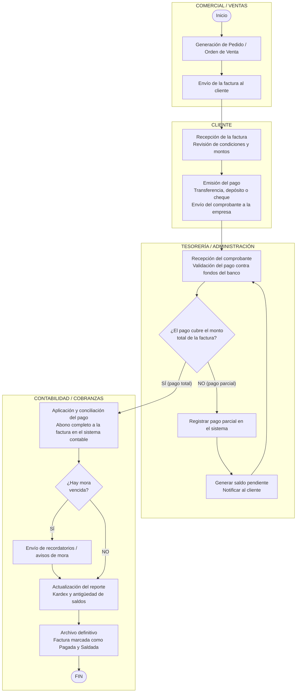

# Diagrama de Proceso de Cuentas por Cobrar

## Leyenda del flujo

| Carril | Participa en |
|---|---|
| COMERCIAL / VENTAS | Generación del pedido y envío de la factura |
| CLIENTE | Recepción, revisión y pago |
| TESORERÍA / ADMINISTRACIÓN | Validación bancaria y decisión total/parcial |
| CONTABILIDAD / COBRANZAS | Conciliación, morosidad, reportes y cierre |

- **Ruta pago total:** Factura → Validación → Conciliación → Cierre → FIN
- **Ruta pago parcial:** Validación → Registro parcial → Notificación → *vuelve a Validación* (bucle hasta saldar)
- **Ruta con mora:** Conciliación → Recordatorios → Actualización de reportes → Archivo → FIN
